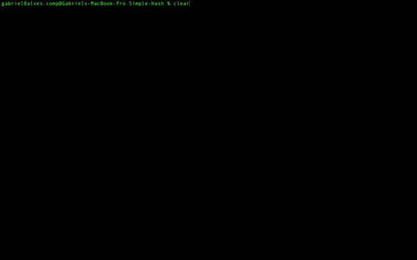

 <h1 align = "center" >Tabela Hash - Endereçamento Fechado</h1>

 <h2> O que é uma Tabela Hash?</h2>
 
 <p align = "justify">
      A Tabela Hash ou Tabela de Dispersão é uma estrutura de dados especial que associa chaves de mapeamento a valores, para indexação de dados. É por meio de uma função matemática, conhecida como <i>Função Hash</i> ou <i>Função de Espelhamento</i>, que faz a associação de uma chave à uma posição. O objetivo de uma Tabela Hash é, por meio de uma simples chave, fazer uma busca de forma rápida e eficiente e assim, conseguir o valor desejado.<br>
      </p>

<h2>Colisões e Endereçamento Fechado</h2>
<p align = "justify">
      Em uma Tabela Hash, quando uma posição já está ocupada e uma outra chave é associada a mesma posição, dizemos que há uma colisão.(Figura 1). Para corrigir as colisões, neste repositório, foi implementado o método de <b>Endereçamento Fechado</b>, que consiste em utilizar <i>Listas Encadeadas</i>. A cada colisão a chave é inserida na lista da posição onde houve a colisão. Ou seja, foi criado um vetor de listas encadeadas. No Vídeo 1, há uma execução  do algoritmo deste reposiório que, apresenta o funcionamendo e o tratamento destas colisões por meio do <b>Endereçamento Fechado</b> com a função de dispersão h(x) = x mod tam, sendo "x" a chave e "tam" o tamanho da tabela.
      </p>

<p align = "center">
 <br>
Figura 1 - Exemplo de Colisão
</p>

<br>

 <p align = "center">
 <br>
Vídeo 1 - Tratamento de colisões com listas encadeadas<br>
</p>

<h2>Qual o custo de uma Tabela Hash com Endereçamento Fechado?</h2>
<p align = "justify">
        O custo para encontrar uma posição na tabela é <i>O(1)</i>. Entretanto, o tratamento de colisão está sendo feito por meio de Lista encadeadas. Ou seja, se pegarmos N igual ao número de registros na tabela e M igual ao tamanho da tabela, temos que o o custo para inserir - único método implementado -, buscar e remover um elemento da tabela é <i>O(1 + N/M)</i>. Sendo N/M o tempo gasto para percorrer a lista.
        </p>
        
<h2>Considerações Finais</h2>
<p align = "justify">
        O <i>Endereçamento Fechado</i> é uma forma simples de corrigir colisões, entretando, para um grande massa de dados pode se tornar custoso. Uma vez que, é necessário percorrer a lista para encontrar o elemento desejado - sendo o pior caso, o ultimo elemento da lista, o elemendo procurado.
        </p>

<h2>Referências</h2>
<p align = "justify">
        <ul>
        <li><a = href = "https://blog.pantuza.com/artigos/tipos-abstratos-de-dados-tabela-hash">Tabela Hash</a> - Gustavo Pantuza</li>
        </ul>
        </p>

<h2>Compilação e Execução</h2>

````
gcc -g *.c -o main && ./main
````

